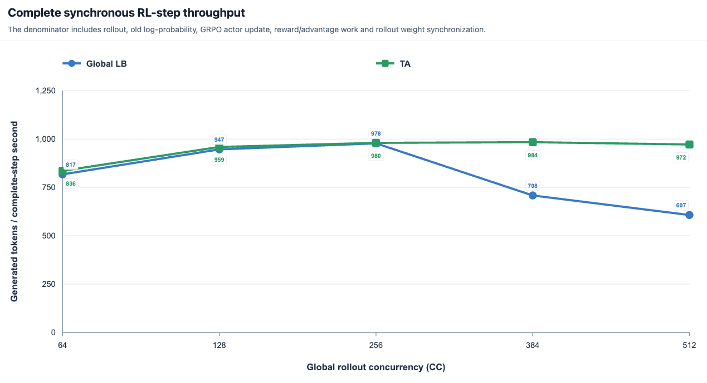
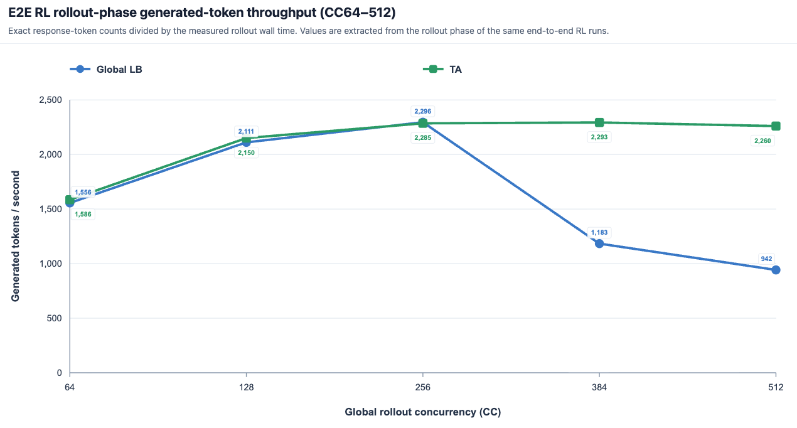
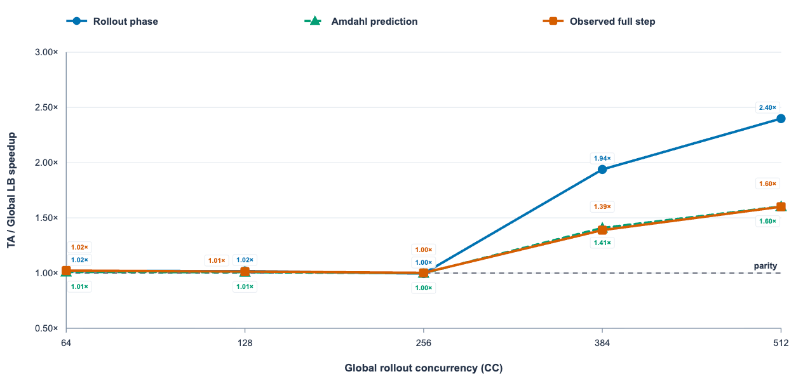

# Dynamo rollout backend for verl

This recipe plugs [NVIDIA Dynamo](https://github.com/ai-dynamo/dynamo) into verl
as a first-class **async rollout backend**, alongside the built-in `vllm`,
`sglang`, and `trtllm` backends. Turning it on is a one-line config change
(`actor_rollout_ref.rollout.name=dynamo`); everything Dynamo-specific
(KV-aware routing, disaggregated frontend/worker topology, KV-cache offload)
is driven from `rollout.engine_kwargs.dynamo.*`.

Dynamo owns request routing behind a single logical frontend, so its
**KV-cache-aware router** can raise the prefix-cache hit rate across a rollout
step. Weight updates still flow through verl's colocated CUDA-IPC path, so the trainer and the `dynamo.vllm`
workers share GPUs the same way the native vLLM backend does.

## How it works

The Dynamo backend keeps verl's AgentLoop execution model but replaces the
rollout server with a Dynamo deployment. A single Ray actor per node
(`DynamoHttpServer`) supervises the whole Dynamo stack as subprocesses; it
reserves **no** GPUs of its own — the colocated trainer workers already own
them, and the actor only forwards `CUDA_VISIBLE_DEVICES` into the
`dynamo.vllm` shards.

```
 verl trainer (colocated, owns GPUs)
        │  HTTP chat/completions            control RPC (sleep / wake /
        │  (per-rank ServerAdapter)         update_weights) via Ray + ZMQ
        ▼                                             │
 ┌─────────────────── DynamoHttpServer (Ray actor, 1 / node) ──────────────────┐
 │  supervises + watchdogs subprocesses, forwards CUDA_VISIBLE_DEVICES          │
 │                                                                             │
 │   dynamo.frontend ──► KV-aware router ──► dynamo.vllm × N  (one / DP shard) │
 │        ▲                                        │                            │
 │        │                                   CUDA IPC + ZMQ weight receiver    │
 │   etcd + nats-server (service discovery / messaging)                        │
 │                                                                             │
 │   optional: KV-cache offload (mooncake / flexkv), per-worker metrics sidecar │
 └─────────────────────────────────────────────────────────────────────────────┘
```

Request routing happens inside Dynamo's KV router, **not** in verl's
`GlobalRequestLoadBalancer` — verl only ever talks to the one shared frontend.

### Key files


| File                                                           | Role                                                                                                                                          |
| -------------------------------------------------------------- | --------------------------------------------------------------------------------------------------------------------------------------------- |
| `[register.py](register.py)`                                   | Registers `dynamo` in verl's rollout registries; loaded via `VERL_USE_EXTERNAL_MODULES=recipe.dynamo.register`.                               |
| `[main_dynamo.py](main_dynamo.py)`                             | Training entry point — `main_ppo` with the `dynamo_trainer` config.                                                                           |
| `[config/dynamo_trainer.yaml](config/dynamo_trainer.yaml)`     | Hydra config: inherits `ppo_trainer`, sets `rollout.name=dynamo`, `rollout.mode=async`.                                                       |
| `[dynamo_async_server.py](dynamo_async_server.py)`             | `DynamoReplica` / `DynamoHttpServer` — spawns and watchdogs etcd, nats-server, `dynamo.vllm` workers, and `dynamo.frontend`.                  |
| `[dynamo_rollout.py](dynamo_rollout.py)`                       | `ServerAdapter` — per-rank client; HTTP generation via the frontend, control RPCs (sleep/wake/`update_weights`) to the shared per-node actor. |
| `[dynamo_agent_loop.py](dynamo_agent_loop.py)`                 | `DynamoServerManager` / `DynamoLLMServerManager` — talk to the single shared frontend instead of load-balancing across replicas.              |
| `[dynamo_worker_extension.py](dynamo_worker_extension.py)`     | vLLM `worker_extension_cls` that maps each DP shard to a node-global rank so trainer and engine agree on the CUDA-IPC socket path.            |
| `[_dynamo_vllm_with_control.py](_dynamo_vllm_with_control.py)` | Private ZMQ control sidecar that bridges verl's `collective_rpc` into the `dynamo.vllm` subprocess.                                           |
| `[metrics_sidecar.py](metrics_sidecar.py)`                     | Optional per-worker system-status / metrics scraper.                                                                                          |


Enable the backend by pointing verl at the recipe's registration module:

```bash
export VERL_USE_EXTERNAL_MODULES=recipe.dynamo.register
```


## Configuration

Everything Dynamo-specific lives under
`actor_rollout_ref.rollout.engine_kwargs.dynamo`. All keys are optional; sane
defaults are applied in `DynamoHttpServer`.


| Key                                                    | Values / example                                         | Purpose                                                                                                  |
| ------------------------------------------------------ | -------------------------------------------------------- | -------------------------------------------------------------------------------------------------------- |
| `router_mode`                                          | `kv` (default), `round-robin`, `random`, `least-loaded`  | Dynamo request-routing policy; `kv` enables KV-cache-aware routing.                                      |
| `kv_offload_backend`                                   | `none` (default), `mooncake`, `flexkv`                   | Where to offload the KV cache between steps.                                                             |
| `kv_offload_reset_timeout_s`                           | `300`                                                    | Deadline for the external KV store to flush on weight update (fail-closed when offload is on).           |
| `frontend_http_port` / `etcd_port` / `nats_port`       | `0` = auto-assign                                        | Fixed ports if you need them.                                                                            |
| `served_model_name`                                    | falls back to `model_config.local_path`                  | Model name the frontend advertises.                                                                      |
| `request_engine_data` / `request_completion_token_ids` | `true` / `false`                                         | Ask the frontend to return `nvext.engine_data` / raw `completion_token_ids` (token-in/token-out for RL). |
| `return_tokens_as_token_ids`                           | `true` / `false`                                         | Emit token ids instead of detokenized text.                                                              |
| `request_timeout_s`                                    | `600` (default; scripts use `1800`)                      | Per-request timeout.                                                                                     |
| `free_engine_on_train`                                 | `true`                                                   | Free the engine (sleep) during the training phase.                                                       |
| `enable_worker_system_metrics`                         | `true` / `false`                                         | Expose the per-worker system-status / metrics port (paired with `metrics_sidecar.py`).                   |
| `extra_args`                                           | `["--generation-config","vllm","--stream-interval=100"]` | Extra CLI args forwarded verbatim to `dynamo.vllm`.                                                      |


## Quick start


### 1. Generation-only smoke

Verifies the full Dynamo stack (etcd + nats + workers + frontend) can serve a
completion, no training loop. Passes when the log prints `PASS:`.

```bash
bash recipe/dynamo/scripts/smoke_dynamo_v1.sh          # Qwen2.5-0.5B-Instruct, 1 GPU
```


### 2. One-node training smoke

```bash
export VERL_USE_EXTERNAL_MODULES=recipe.dynamo.register
python3 recipe/dynamo/main_dynamo.py \
    algorithm.adv_estimator=grpo \
    data.train_files=.../gsm8k/train.parquet \
    data.val_files=.../gsm8k/test.parquet \
    actor_rollout_ref.model.path=Qwen/Qwen2.5-0.5B-Instruct \
    actor_rollout_ref.rollout.name=dynamo \
    actor_rollout_ref.rollout.mode=async \
    actor_rollout_ref.rollout.engine_kwargs.dynamo.router_mode=kv \
    trainer.n_gpus_per_node=2 trainer.nnodes=1 \
    trainer.total_training_steps=2
```


### 3. Multi-node 30B RL

`Qwen3-30B-A3B-Base` RL runs (KV router and metrics
variants) live in the top-level scripts:

```bash
sbatch recipe/dynamo/train_30b_rl_dynamo_kv_metrics.sh     # KV router + metrics
```


## NIXL weight sync (checkpoint engine)

By default the trainer pushes weights to the Dynamo workers through verl's
naive CUDA-IPC path. Setting

```bash
actor_rollout_ref.rollout.checkpoint_engine.backend=nixl \
actor_rollout_ref.rollout.checkpoint_engine.update_weights_bucket_megabytes=1024
```

routes refit through verl's `CheckpointEngineManager` instead: the recipe
spawns one `CheckpointEngineWorker` Ray actor per rollout rank (colocated on
the paired GPU — CUDA IPC requires same-GPU pairing) and NIXL moves the
buckets down a trainer → CE₁ → … → CEₙ chain, which crosses nodes at most
twice regardless of world size.

### Support matrix

| backend | single-node | multi-node |
|---|---|---|
| naive | ✅ | ✅ |
| NIXL  | ✅ | ✅ (2×8 GPU validated) |

### Transport selection (read this before multi-node)

NIXL's default backend is UCX, and UCX picks its transport from `UCX_TLS`.
The right setting depends on the RDMA fabric:

| fabric | recommendation |
|---|---|
| RDMA with native RDMA-read (e.g. InfiniBand / RoCE) | `UCX_TLS=cuda_ipc,cuda_copy,rc,tcp` — `rc` gives native RDMA read at line rate. |
| RDMA without native RDMA-read (send/recv-only protocols) | UCX can only emulate one-sided reads over send/recv — we measured 0.23 GB/s. Use NIXL's **LIBFABRIC** backend instead: `+actor_rollout_ref.rollout.checkpoint_engine.engine_kwargs.nixl.backends=[LIBFABRIC]`, with your fabric's libfabric provider (≥1.18) on `LD_LIBRARY_PATH`. Same 1 GiB cross-node read: **48.5 GB/s**. |

Cross-node measured on 2 nodes × 8×H100 (RDMA fabric), 3-step GRPO,
step-3 `update_weights`:

| model | naive | NIXL UCX (tcp / one-sided read emulated over send/recv) | NIXL LIBFABRIC |
|---|---|---|---|
| Qwen2.5-0.5B | 3.08 s | 12.2 s / 11.6 s | 3.09 s |
| Qwen3-8B | 29.7 s | — | **27.1 s** |

At 0.5B the LIBFABRIC path is at parity with naive (the shared per-rank
engine-consume dominates); at 8B it is ~9% faster. The UCX column shows
the send/recv emulation ceiling — protocol-level, not tunable.

Two helpers ship with the recipe: `run_nixl_smoke.sh` (a 3-step GRPO
training smoke parameterised over `NNODES` / `CE_BACKEND`) and
`nixl_bench.py` (a standalone cross-node bandwidth probe for checking
what a fabric actually delivers before debugging the training path).
When running in containers/Kubernetes, give worker pods the fabric's
RDMA device resource (e.g. `rdma/ib`) and the `IPC_LOCK` capability —
NIXL needs it to pin memory for RDMA registration, and transfers hang
without it.

> `engine_kwargs.nixl.backends` requires a small verl-side change (a
> `backends` kwarg on `NIXLCheckpointEngine`, pending as a separate verl
> PR); on IB/RoCE
> fabrics the stock UCX backend needs no verl change.

## KV-aware routing result

The matched comparison below keeps only Dynamo KV routing with
`stream-interval=100` and the native vLLM baseline. Lower `ms/token` is better;
the similar response lengths are a sanity check that generation behavior stayed
comparable.


| Backend                           | ms/token | Mean response length | KV-cache hits / queries | KV-cache hit rate |
| --------------------------------- | -------- | -------------------- | ----------------------- | ----------------- |
| Dynamo KV (`stream-interval=100`) | 1.5956   | 876.1                | 2,248,368 / 2,520,362   | 89.21%            |
| vLLM baseline                     | 1.7220   | 872.3                | 1,860,816 / 2,432,064   | 76.51%            |


Per-step timing per token from the KV-aware router comparison

Dynamo KV is approximately **7.3% faster per generated token** in this
comparison and improves the KV-cache hit rate by **12.70 percentage points**.

## Running a full agent-loop RL run

The quick-start examples above are single-turn smoke tests. A real RL run drives
a **multi-turn agent loop** (tool calls, an external environment, a custom
reward) through the Dynamo frontend. The pieces below are what that adds on top
of the smoke test; everything is parameterised, so drop in your own model, data,
and agent loop.

### Trainer: currently no fully_async

Dynamo has **no** `fully_async` **trainer**. Run it through `verl.trainer.main_ppo`
(or this recipe's `main_dynamo.py`) with `actor_rollout_ref.hybrid_engine=True`.
`DynamoLLMServerManager` is colocated — it forwards the trainer's
`CUDA_VISIBLE_DEVICES` into the `dynamo.vllm` shards — so `hybrid_engine=True` is
required, not optional.

### Wire in your agent loop

These overrides turn a plain GRPO run into a multi-turn agent-loop run served by
Dynamo. The config path and loop name are **yours** — this recipe does not ship
an agent loop:

```bash
actor_rollout_ref.rollout.mode=async \
actor_rollout_ref.rollout.multi_turn.enable=True \
actor_rollout_ref.rollout.agent.num_workers=64 \
actor_rollout_ref.rollout.agent.agent_loop_config_path=/path/to/agent_config.yaml \
actor_rollout_ref.rollout.agent.default_agent_loop=<your_loop_name> \
+actor_rollout_ref.rollout.agent.agent_loop_manager_class=recipe.dynamo.dynamo_agent_loop.DynamoAgentLoopManager
```

The `agent_loop_manager_class` override is the key one: it swaps verl's default
manager for `DynamoAgentLoopManager`, which talks to the single shared Dynamo
frontend instead of load-balancing across replicas.

### Recommended `engine_kwargs.dynamo` for RL

Token-in/token-out generation (so the trainer scores the exact tokens the engine
produced), KV-aware routing, and freeing engine memory during the training
phase. See the Configuration table above for every key.

```bash
++actor_rollout_ref.rollout.engine_kwargs.dynamo.router_mode=kv \
++actor_rollout_ref.rollout.engine_kwargs.dynamo.request_engine_data=true \
++actor_rollout_ref.rollout.engine_kwargs.dynamo.request_completion_token_ids=true \
++actor_rollout_ref.rollout.engine_kwargs.dynamo.return_tokens_as_token_ids=false \
++actor_rollout_ref.rollout.engine_kwargs.dynamo.request_timeout_s=1800 \
++actor_rollout_ref.rollout.engine_kwargs.dynamo.free_engine_on_train=true \
++actor_rollout_ref.rollout.engine_kwargs.dynamo.enable_worker_system_metrics=true \
'++actor_rollout_ref.rollout.engine_kwargs.dynamo.extra_args=["--generation-config","vllm","--stream-interval=100"]'
```


### Optional: KV-metrics sidecar

With `enable_worker_system_metrics=true`, each `dynamo.vllm` worker writes an
`.endpoints` file under `$VERL_DYNAMO_WORKER_METRICS_DIR`. Run the sidecar
alongside training to scrape those `/metrics` endpoints into JSONL (KV-cache hit
rate, queue depth, …):

```bash
python3 recipe/dynamo/metrics_sidecar.py \
    --endpoints-glob "$VERL_DYNAMO_WORKER_METRICS_DIR/*.endpoints" \
    --output /path/to/logs/kv_metrics.jsonl \
    --label dynamo_kv --interval 30 &
```


## ThunderAgent extension

This recipe extends the Dynamo rollout backend End-to-end ThunderAgent from
[verl-recipe PR #110](https://github.com/verl-project/verl-recipe/pull/110)
with program-aware scheduling for multi-turn agent trajectories. It does not
modify core `verl` or Dynamo.

### Required versions

- Dynamo: source commit `59d614641837e593f0567b79d75394aae5f864e0`, including
[PR #11185](https://github.com/ai-dynamo/dynamo/pull/11185).


### Topology

With ThunderAgent enabled, verl launches processes in this order:

```text
etcd -> NATS -> Dynamo vLLM workers -> ThunderAgent router -> frontend
```

The frontend uses round-robin only to reach the registered ThunderAgent
handler. ThunderAgent owns the internal KV router and forwards to the worker
endpoint `<namespace>.backend.generate`. Shutdown reverses the consumer side:
frontend, ThunderAgent, workers, NATS, then etcd.

### Configuration

The default recipe enables ThunderAgent:

```yaml
actor_rollout_ref:
  rollout:
    agent:
      agent_loop_manager_class: recipe.dynamo.dynamo_agent_loop.DynamoAgentLoopManager
    engine_kwargs:
      dynamo:
        thunderagent:
          enabled: true
          router_block_size: 16
```

`router_block_size` is applied to both vLLM and ThunderAgent. Pass scheduler CLI options without hard-coding them in the recipe:

```yaml
thunderagent:
  enabled: true
  router_block_size: 16
  extra_args:
    - --pause-threshold
    - "0.95"
```

Optional finalization controls are `finalize_max_attempts` (default `3`) and `finalize_retry_delay_s` (default `0.1`). Set `thunderagent.enabled=false` for
the PR #110 KV-router baseline.

### Run

From a verl checkout containing this repository at `recipe/`:

```bash
VERL_USE_EXTERNAL_MODULES=recipe.dynamo.register \
python -m recipe.dynamo.main_dynamo \
  actor_rollout_ref.model.path=/path/to/model \
  actor_rollout_ref.rollout.tensor_model_parallel_size=1
```

Supply the remaining dataset, trainer, and resource overrides required by the standard verl PPO configuration.

### UniAgent variants

`[run_uniagent_variant.sh](run_uniagent_variant.sh)` is a concise UniAgent training example. Select one rollout path with `VARIANT`:

- `ta` (default): Dynamo with ThunderAgent enabled.
- `dynamo`: the native Dynamo KV-router baseline with ThunderAgent disabled.
- `global`: the native verl vLLM rollout baseline, bypassing Dynamo. The
historical name does not mean that this script explicitly configures a
GlobalLoadBalancer.

Run it from the verl root:

```bash
VARIANT=ta RAY_DATA_HOME=/path/to/verl-data \
bash recipe/dynamo/run_uniagent_variant.sh

VARIANT=dynamo RAY_DATA_HOME=/path/to/verl-data \
bash recipe/dynamo/run_uniagent_variant.sh

VARIANT=global RAY_DATA_HOME=/path/to/verl-data \
bash recipe/dynamo/run_uniagent_variant.sh
```

### End-to-end ThunderAgent result

The ThunderAgent comparison used the following matched setup:

- Uni-Agent × verl synchronous end-to-end GRPO, including rollout,
reward/advantage, old log-probability, actor update, and weight
synchronization.
- Training and inference colocated and time-multiplexed on 8 × NVIDIA H20-3e
GPUs (140.4 GiB/GPU), with two TP4 replicas.
- Qwen3-Coder-30B-A3B-Instruct.
- The only backend change was verl Global LB versus Dynamo ThunderAgent.

Here, `rollout.mode=async` only enables concurrent agent requests within the
rollout phase; the RL algorithm remains synchronous and does not use a
`staleness_threshold`. Rollout throughput is generated response tokens divided
by rollout wall time. Full-step throughput also includes reward/advantage,
old-log-probability, actor-update, and weight-synchronization time.





At concurrency 64–256, ThunderAgent and Global LB are near parity. At
concurrency 384, ThunderAgent reaches **1.94× rollout-phase speedup** and
**1.39× observed full-step speedup**; at concurrency 512, the speedups reach
**2.40×** and **1.60×**, respectively.


